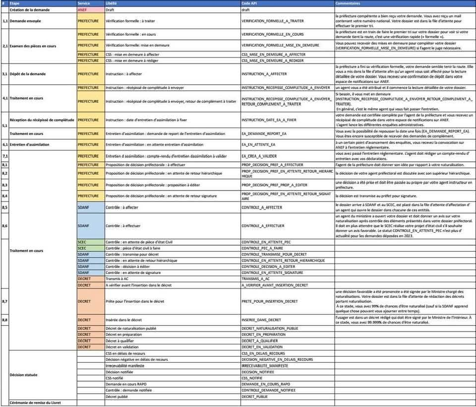

# Naturalisation ANEF Checker

[](https://www.gnu.org/licenses/gpl-3.0.en.html)
[](https://www.python.org/downloads/)

## Overview

`anef_checker` is a simple Python tool designed to check the status of your naturalization process through ANEF. It provides both a command-line interface (CLI) and a graphical user interface (GUI) to interact with the system efficiently.

## API Status Codes

⚠️ The meaning of the API status codes was retrieved from a low-quality image found on Facebook, so it may not be entirely accurate. If you have more recent or accurate information, please let me know so we can update this section.



## Features

- **Command-line Interface (CLI)**: Easily check your status via terminal commands.
- **Graphical User Interface (GUI)**: A simple and interactive way to check your naturalization status.
- **Secure Credential Handling**: Uses environment variables to store login credentials securely.

## Installation

### Requirements

- Python>=3.11
- `pip` package manager
- Chrome browser installed (required for Selenium)

### Install using pip

```bash
pip install anef_checker
```

### Install from source

```bash
git clone https://github.com/ever3001/anef_checker.git
cd anef_checker
pip install .
```

## Usage

### CLI Mode

Run the following command to check your naturalization status:

```bash
anef_checker check --name "your_username" --password "your_password"
```

**Options:**

- `-n, --username`: Your ANEF web username.
- `-p, --password`: Your ANEF web password.
- `-l, --language`: Language for the status description (`fr`, `en`, `es`).

Example:

```bash
anef_checker check --username "user@example.com" --password "mypassword" --language fr
```

### Credential Management

Instead of passing your credentials as command-line arguments, you can securely store them using environment variables or a `.env` file:

- **Environment Variables:**Set your credentials in your shell configuration or export them before running the command:

```sh
export ANEF_WEB_USERNAME="your_username"
export ANEF_WEB_PASSWORD="your_password"
```

- **`.env` File:**Create a `.env` file in the project's root directory and define your credentials there:A sample configuration file is available at [`sample.env`](samples/sample.env).

```ini
ANEF_WEB_USERNAME=your_username
ANEF_WEB_PASSWORD=your_password
```

This allows for a more secure and reusable setup, preventing sensitive information from being exposed in command history.

### GUI Mode

Run the following command to launch the GUI:

```bash
anef_checker_gui
```

This will open a graphical application where you can enter your credentials and check your status easily.

## Contributing

We welcome contributions! If you would like to contribute:

- Report bugs via [GitHub Issues](https://github.com/ever3001/anef_checker/issues).
- Implement new features by checking open issues.
- Improve documentation.

Refer to the [Contributing Guide](CONTRIBUTING.md) for more details.

## License

This project is licensed under the GPL-3.0-or-later License.
